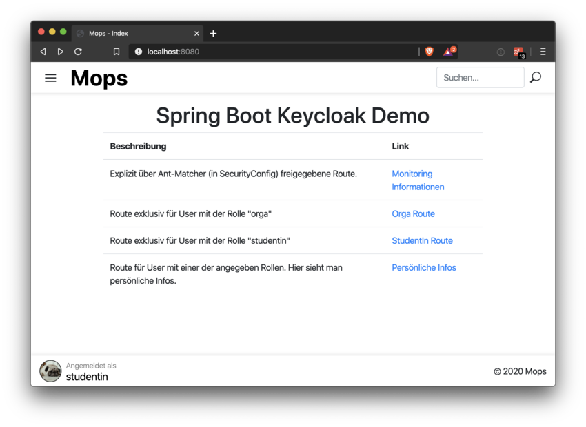

= Spring Boot: Keycloak Demo
:experimental:
:icons: font
:icon-set: octicon
:source-highlighter: rouge
ifdef::env-github[]
:tip-caption: :bulb:
:note-caption: :information_source:
:important-caption: :heavy_exclamation_mark:
:caution-caption: :fire:
:warning-caption: :warning:
endif::[]

Diese Spring Boot Anwendung ist eine Demo, welche die Anbindung an link:https://www.keycloak.org/[Keycloak] und das Verwenden einer REST-API hiermit zeigt.

Es wird Spring Security benutzt um einzelne Routen nur für Nutzer gewisser Rollen zu erlauben.

IMPORTANT: Diese Demo basiert auf und nutzt die bestehende Demo https://github.com/hhu-propra2/keycloak-demo.

Diese Demo nutzt ebenfalls den am Institut eingerichteten Keycloak-Service unter https://keycloak.cs.hhu.de .

== Installation

Es wird ein JDK 11 benötigt.

Die Applikation kann einfach über den mitgelieferten Gradle Wrapper gestartet werden:

    ./gradlew bootRun

IMPORTANT: Diese Demo benötigt die andere Demo, welche eine REST-API bereitstellt. Sie müssen beide Applikationen starten.

== Nutzung

Öffnen Sie die Startseite http://localhost:8081. Von hier aus können Sie die verschiedenen Routen anklicken.
Sie müssen sich anschließend eventuell über Keycloak einloggen um Zugang zu erhalten.

== Funktionsweise & Implementierung

Die Funktionsweise ist im Prinzip identisch zur bestehenden Keycloak Demo. Alleine das Nutzen der REST-API ist hier umgesetzt.

=== REST call

Um einen REST-call an eine mit `@Secured` gesicherte Route durchzuführen, können Sie sich ein entsprechendes `RestTemplate` injecten lassen.

[source,java]
----
@Autowired
RestTemplate serviceAccountRestTemplate;

@GetMapping("/")
@Secured({"ROLE_studentin","ROLE_orga"})
public String index(KeycloakAuthenticationToken token,Model model) {

    /**
     * THIS IS JUST AN EXAMPLE! DO NOT QUERY A SERVICE IN THE REQUEST/RESPONSE CYCLE!
     */
    var res = Arrays.asList(serviceAccountRestTemplate.getForEntity("http://localhost:8080/api/text", Entry[].class).getBody());

----

Damit dies funktioniert muss eine `@Bean` annotierte Methode mit dem Namen `serviceAccountRestTemplate` in einer Konfigurationsklasse enthalten sein.
Sie können diese Methode einfach aus der `KeycloakConfig` Klasse des `keycloak-client-demo` Projektes entnehmen.

[source,java]
----
@Value("${keycloak.resource}")
private String clientId;
@Value("${keycloak.credentials.secret}")
private String clientSecret;
@Value("${hhu_keycloak.token-uri}")
private String tokenUri;

@Bean public RestTemplate serviceAccountRestTemplate(){
    ClientCredentialsResourceDetails resourceDetails = new ClientCredentialsResourceDetails();
    resourceDetails.setGrantType(OAuth2Constants.CLIENT_CREDENTIALS);
    resourceDetails.setAccessTokenUri(tokenUri);
    resourceDetails.setClientId(clientId);
    resourceDetails.setClientSecret(clientSecret);

    return new OAuth2RestTemplate(resourceDetails);
}
----

